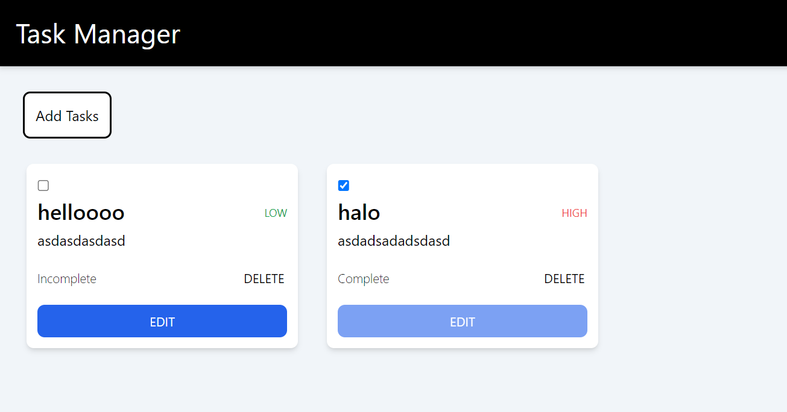
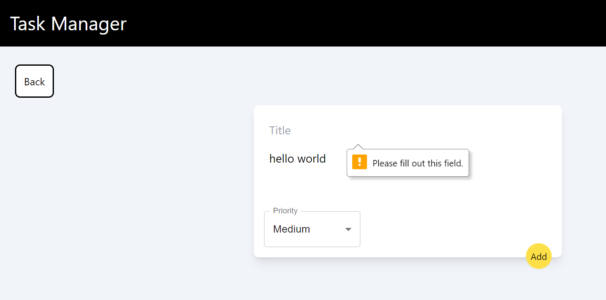
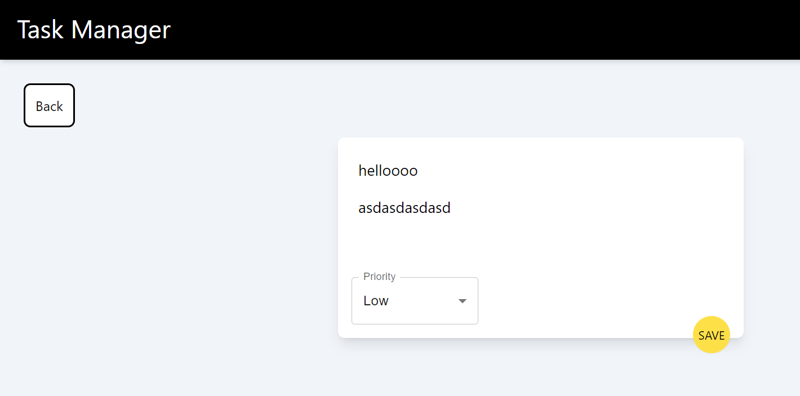

# Task Management App

Steps to setup the project on your system:
1. Clone the repository
2. Open the folder in which you cloned the repo in an IDE
3. Run 'npm i' in the terminal to install the required dependencies
4. Run 'npm run dev' to host the project on a localhost.

Project Structure:

    Pages:
        Task list page
        Add tasks page

    Components:
        Add task form
        Edit task form
        Header
        Task
    
    Context:
        Context provider

For styling and responsiveness, TailwindCSS has been used.

